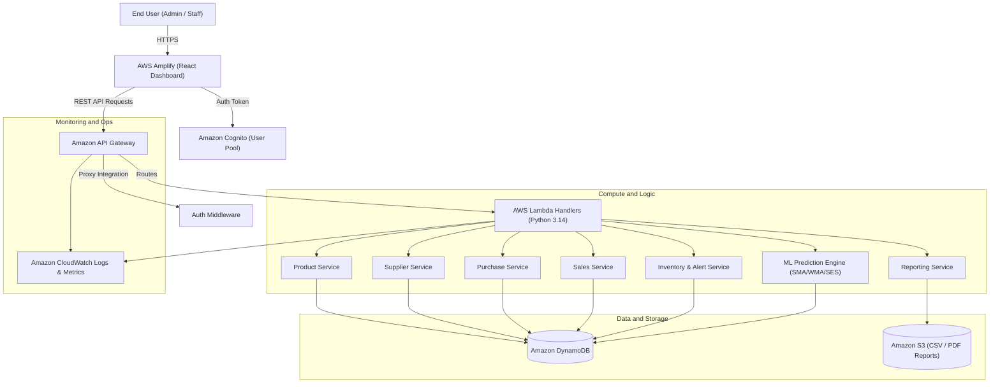

# Architecture Documentation: Cloud-Based Intelligent Inventory Management & Stock Prediction

## 1. System Architecture Overview

The application follows an enterprise-grade, serverless, decoupled cloud architecture designed to run seamlessly in two modes:
1. **Local Development Mode:** Zero-cost local execution using FastAPI and embedded storage, ideal for development, debugging, and offline academic demonstrations.
2. **AWS Cloud Production Mode:** High-availability serverless deployment leveraging AWS Amplify, Amazon Cognito, Amazon API Gateway, AWS Lambda, Amazon DynamoDB, Amazon S3, and Amazon CloudWatch.



---

## 2. Core Architectural Subsystems

### 2.1 Presentation Layer (Frontend)
- **Framework:** React 18 with Vite for modern, fast HMR bundling.
- **Design System:** Custom CSS design system featuring:
  - Responsive sidebar layout with sticky top header and active navigation breadcrumbs.
  - Dark/Light theme toggle with CSS custom properties.
  - KPI metric cards with trend indicators and status chips.
  - Interactive data tables with real-time text filtering, category filters, and sorting.
  - Visual charts (Sales Trends, Stock Distribution, Demand Forecast vs. Current Inventory).
  - Modal dialogues for record entry and confirmations for destructive actions.
  - Live notification alerts banner for out-of-stock and low-stock items.

### 2.2 Application / API Layer
- **Framework:** RESTful API with standard HTTP verbs (`GET`, `POST`, `PUT`, `DELETE`).
- **Input Validation:** Strict Pydantic models ensuring data hygiene, type coercion, and non-negative constraints.
- **Error Handling:** Standardized JSON error response envelope:
  ```json
  {
    "success": false,
    "error": "Error message description",
    "details": {}
  }
  ```

### 2.3 Storage Layer (DynamoDB & S3)
- **Primary Data Store:** Amazon DynamoDB.
  - Supports both a clean Multi-Entity table structure and Single-Table Design patterns.
  - Zero server management, instantaneous scaling, and sub-10ms query latency.
  - Partition Key (`PK`) and Sort Key (`SK`) optimized for transactional lookups and time-series queries.
- **Document & File Store:** Amazon S3.
  - Stores exported inventory audit CSV files and generated executive PDF reports.
  - Pre-signed URLs for secure, authenticated client downloads.

### 2.4 Intelligent Forecasting Subsystem (ML)
- **Historical Analysis:** Queries historical sales records partitioned by product ID over configured time windows (e.g., 30, 60, or 90 days).
- **Time-Series Aggregation:** Resamples and fills daily sales volumes.
- **Statistical Demand Models:**
  1. **Simple Moving Average (SMA):** Smooths short-term fluctuations to calculate steady baseline demand.
  2. **Weighted Moving Average (WMA):** Assigns linearly higher weights to recent days to capture emerging trends.
  3. **Single Exponential Smoothing (SES):** Utilizes an optimal smoothing factor ($\alpha \in [0.1, 0.5]$) to adaptively track demand drift.
- **Restocking Optimization:**
  $$\text{Safety Stock} = Z \times \sigma_L = 1.65 \times \sqrt{L} \times \sigma_d$$
  $$\text{Recommended Order} = \max(0, \text{Forecasted Demand during Lead Time} + \text{Safety Stock} - \text{Current Stock})$$

---

## 3. Security Architecture
1. **Identity & Access Management:** User pools in Amazon Cognito with JWT token verification.
2. **Role Separation:**
   - `Admin`: Full CRUD over products, suppliers, purchases, sales, system settings, and data seeding.
   - `Staff`: Create sales/purchases, view inventory, view predictions, and export reports.
3. **Data Protection:** Data encrypted at rest via AWS KMS (DynamoDB default encryption) and in transit via TLS 1.3.
4. **Environment Isolation:** Zero credentials in code; configuration driven via `.env` or AWS Systems Manager Parameter Store.
